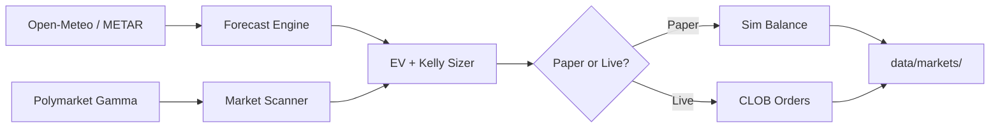

# WeatherBet — Polymarket Weather Trading Bot

Automated trading on Polymarket temperature markets. Compares multi-source weather forecasts (Open-Meteo, METAR) against market prices, gates entries on expected value, sizes with fractional Kelly, and persists state under `data/markets/`.

[](https://nodejs.org/)
[](https://www.typescriptlang.org/)
[](LICENSE)

## Overview

Markets resolve on airport **METAR** station IDs (e.g. `KLGA`, `KORD`, `KDAL`) — not city-center geocoding.

| Stage | Module |
|-------|--------|
| Scan | `scan.ts` — Gamma discovery, station mapping |
| Forecast | `forecasts.ts` — ECMWF, HRRR/GFS via Open-Meteo; METAR via Aviation Weather |
| Size | `math.ts` — EV gate, fractional Kelly, calibration from history |
| Execute | `clob.ts` (live) or simulated balance (paper) |
| Persist | `storage.ts` → `data/markets/` |

Risk controls: EV gate before entry, spread filter (skip if spread > $0.03), ~20% stop-loss, breakeven trail after +20% gain.

## Requirements

- Node.js 20.10+
- Paper mode: no wallet
- Live mode: Polygon wallet + Polymarket proxy

## Install

```bash
git clone https://github.com/risedownlabs/polymarket-weather-bot.git
cd polymarket-weather-bot
npm install
cp env.example .env
```

## Run

**Paper** (default — `WEATHERBOT_CLOB_LIVE` unset or `0`):

```bash
npm run dev -- run
npm run dev -- status
npm run dev -- report
```

**Live**:

```env
WEATHERBOT_CLOB_LIVE=1
WEATHERBOT_POLY_PRIVATE_KEY=0x...
WEATHERBOT_POLY_PROXY_WALLET=0x...
```

```bash
npm run build
npm start -- run
```

| Command | Description |
|---------|-------------|
| `npm start -- run` | Scan loop + position monitor |
| `npm start -- status` | Balance and open positions |
| `npm start -- report` | Resolved market stats |
| `npm run dev -- <cmd>` | Development via `tsx` |

## Configuration

All variables use `WEATHERBOT_*` prefix (`src/config.ts`, `env.example`).

| Variable | Purpose |
|----------|---------|
| `WEATHERBOT_VC_KEY` | Visual Crossing API key |
| `WEATHERBOT_CLOB_LIVE` | `1` = live CLOB; `0`/unset = paper |
| `WEATHERBOT_POLY_PRIVATE_KEY` | Signing key (live) |
| `WEATHERBOT_POLY_PROXY_WALLET` | Polymarket funder (live) |

### Data sources

| Source | Auth | Use |
|--------|------|-----|
| Open-Meteo | None | ECMWF, HRRR/GFS |
| Aviation Weather | None | Live METAR |
| Polymarket Gamma | None | Markets, `clobTokenIds` |
| Visual Crossing | API key | Historical / resolution helpers |

## Pipeline



## Source layout

```
src/
├── index.ts
├── scan.ts
├── forecasts.ts
├── math.ts
├── polymarket.ts
├── clob.ts
├── storage.ts
└── report.ts
data/markets/
```

## Calibration

Resolved markets under `data/markets/` feed back into sizing logic. Run `report` to inspect win rate and calibration drift before enabling live mode.

## Limitations

- Model error, station changes, or late METAR revisions can move resolution away from forecast buckets.
- Paper mode uses Gamma prices; live slippage and fill timing differ.

## License

MIT — see [LICENSE](LICENSE).
